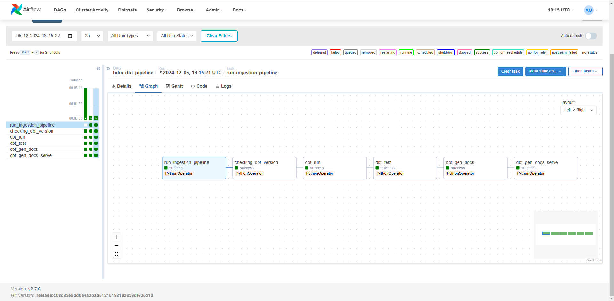
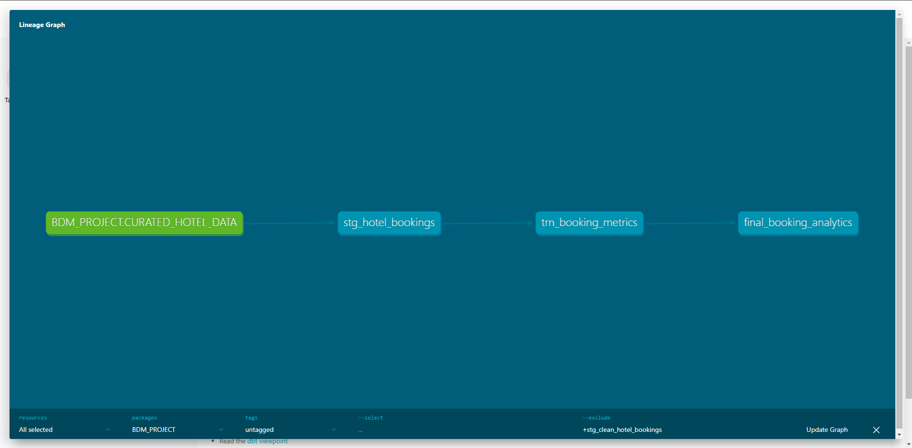
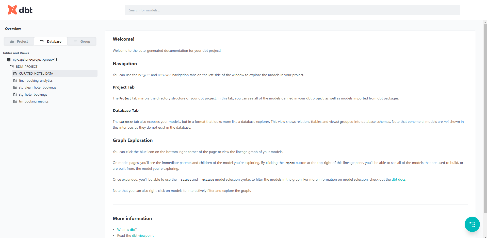
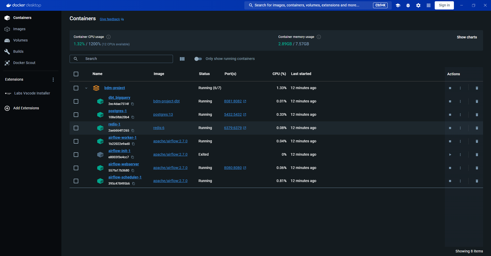
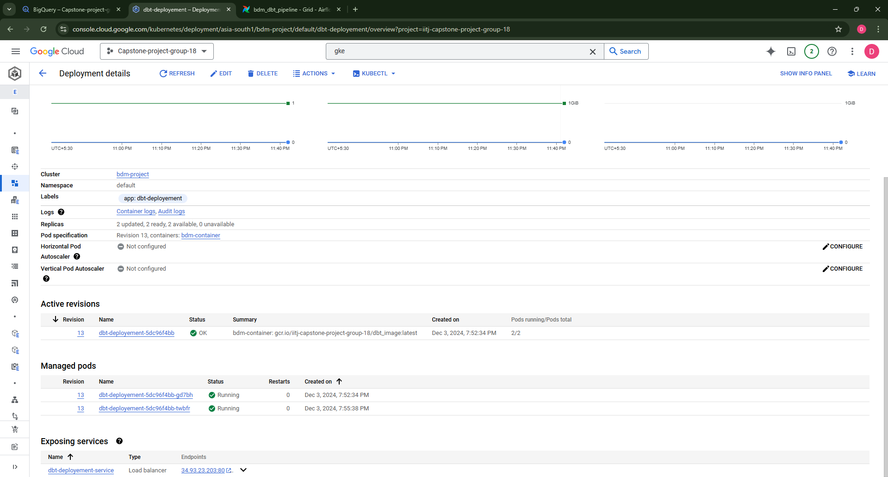
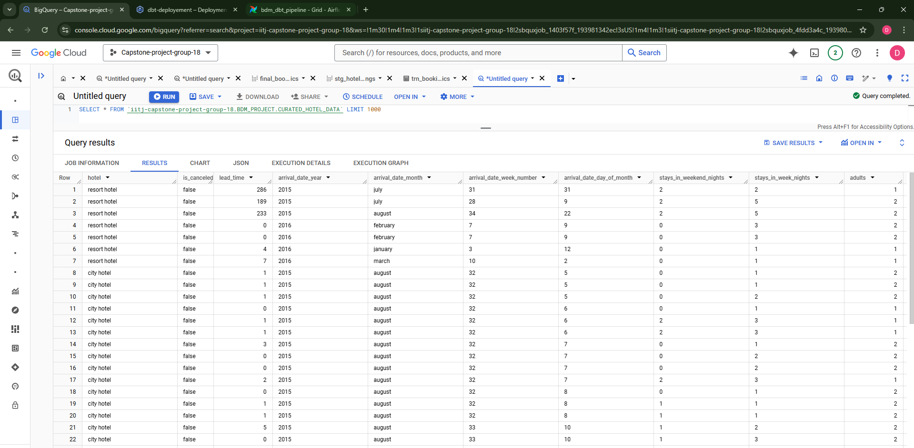
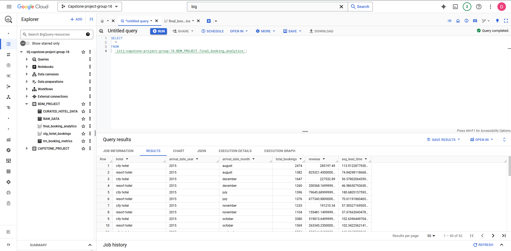
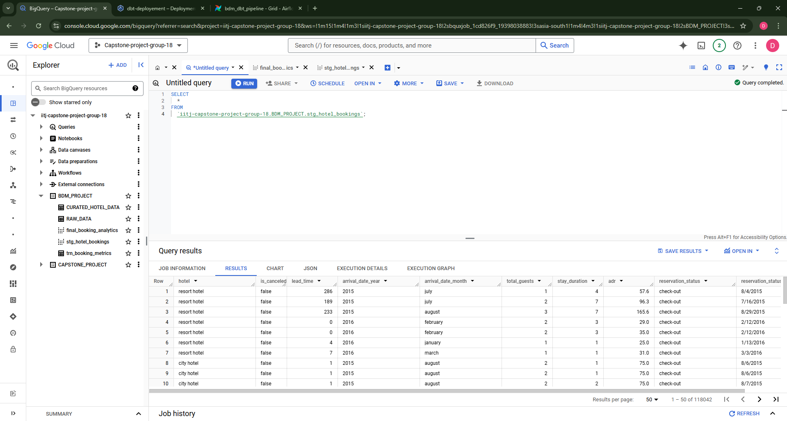
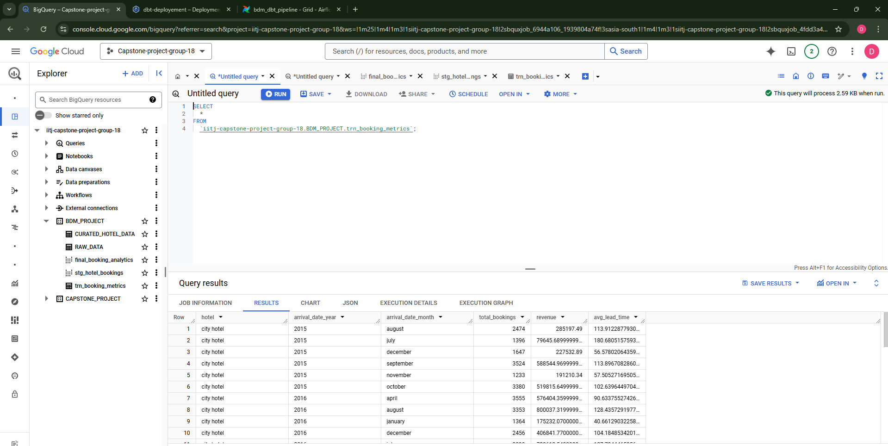

# BDM Project: Data Ingestion and Transformation Pipeline

## Overview
This project focuses on building a robust data ingestion and transformation pipeline using **Apache Airflow**, **DBT**, and **Google BigQuery**. The pipeline ingests raw hotel booking data, cleans and transforms it, and finally loads the curated data into BigQuery for analytics.

## Key Components

### 1. **Data Pipeline (Airflow DAG)**
The pipeline is defined in `Data_pipeline.py` and consists of the following steps:
- **Data Ingestion**: Executes the `main.py` script within the `dbt_bigquery` Docker container to fetch raw data from BigQuery and clean it.
- **DBT Operations**: Executes commands in the DBT environment to:
  - Check DBT version (`dbt --version`)
  - Run models (`dbt run`)
  - Test models (`dbt test`)
  - Generate and serve documentation (`dbt generate docs` and `dbt docs serve`).

The DAG visually depicts task dependencies and execution flow, as seen in the uploaded `dbt_dag_graph.png`.

### 2. **Data Cleaning Script**
Located in `main.py`, this script:
- Fetches raw data from the `RAW_DATA` table in BigQuery.
- Performs data cleaning, including handling missing values, correcting data types, and removing invalid rows.
- Writes the cleaned data into the `CURATED_HOTEL_DATA` table in BigQuery.

### 3. **DBT Models**
DBT (Data Build Tool) is used for further transformations and creating analytics-ready datasets.

### 4. **Deployment**
The pipeline is deployed using:
- **Docker Compose** for local development and testing. Refer to `docker_deployment.png`.
- **Google Kubernetes Engine (GKE)** for scalable production deployments, as illustrated in `gke_deployment.png`.

### 5. **BigQuery**
The project uses BigQuery for data storage and analytics. Key datasets include:
- `RAW_DATA`
- `CURATED_HOTEL_DATA`
- Intermediate analytics tables:
  - `final_booking_analytics` (`BQ_Final_Booking_Analytics.png`)
  - `stg_hotel_bookings` (`Staging_Hotel_Booking.png`)
  - `trn_booking_metrics` (`Trend_Analytics.png`)

### 6. **GitHub Actions Workflow**
Automated CI/CD pipelines are implemented using GitHub Actions for deploying Airflow DAGs and Docker containers to GKE (`github_workflow.png`).

## Prerequisites
- **Google Cloud Project** with BigQuery and GKE enabled.
- Docker and Docker Compose installed locally.
- Python 3.8+ for running scripts locally.

## Setup Instructions

### Local Development
1. Clone the repository:
   ```bash
   git clone <repository-url>
   cd <repository-name>
   ```

2. Build and run the Docker containers:
    ```bash
    docker-compose up --build
    ```

3. Access the Airflow web server at http://localhost:8080.

4. Trigger the bdm_dbt_pipeline DAG in Airflow.

### Deployment to GKE
Configure a GKE cluster in your Google Cloud project.
Build and push the Docker images to a container registry.
Deploy the application using Kubernetes manifests.

### Visualizations

DAG Workflow


DBT Lineage


DBT DashBoard


Docker Deployment


GKE Deployment


Curated Data


Final booking Analytics


Staging Booking table


Trend data table


### Future Enhancements

Add automated monitoring for pipeline failures.
Integrate alerting using Slack or email.
Implement advanced transformations and analytics using DBT macros.

#### Contributers
- JD / Jeyadev L